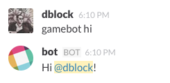
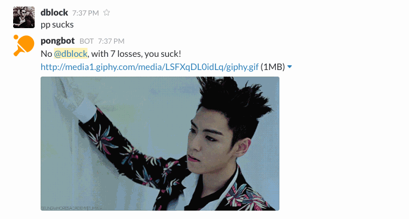
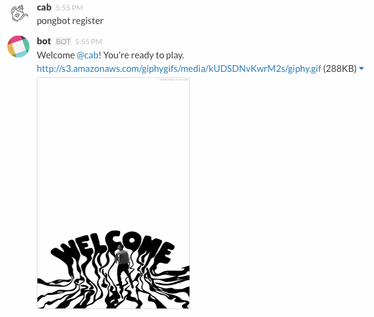
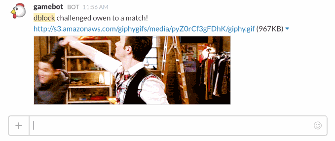
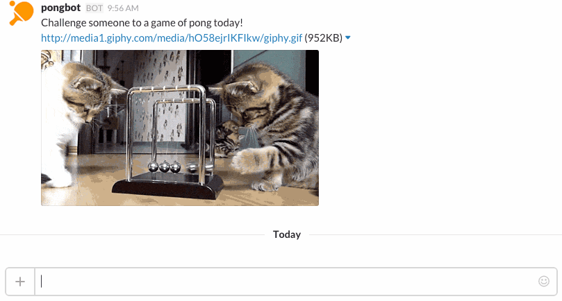
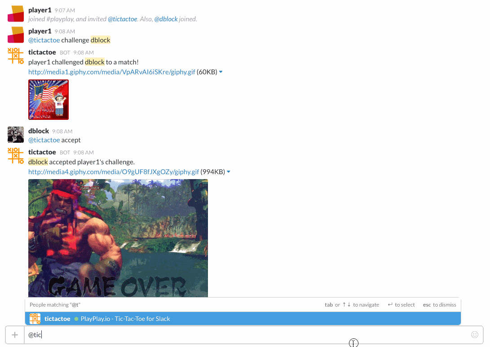
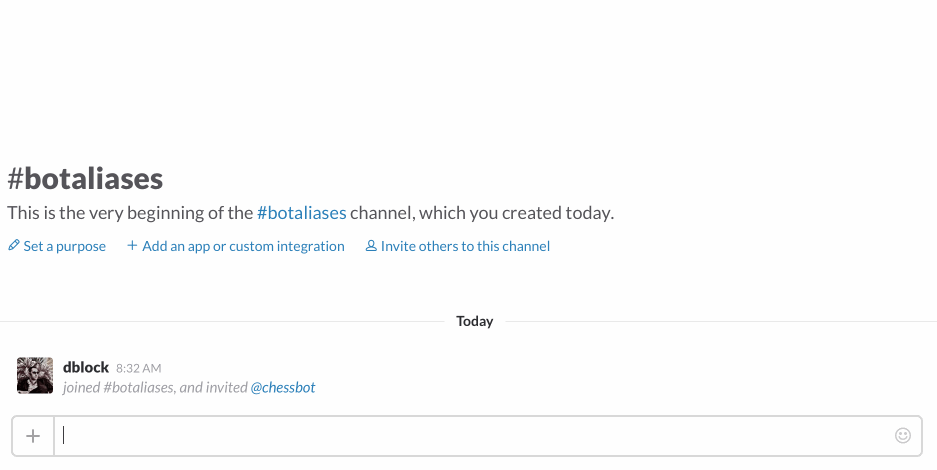
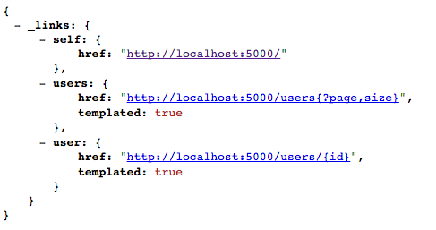

Slack-Gamebot
=============

[](https://www.playplay.io)

Or roll your own ...

[](https://travis-ci.org/dblock/slack-gamebot)
[](https://codeclimate.com/github/dblock/slack-gamebot)
[](https://gemnasium.com/dblock/slack-gamebot)

A generic game bot for slack. Works for ping-pong (2, 4 or more players), chess, etc. Inspired by [slack-pongbot](https://github.com/andrewvy/slack-pongbot), but more robust, generic and easier to improve and contribute to.


## Installation

Create a new Bot Integration under [services/new/bot](http://slack.com/services/new/bot). Note the API token.
You will be able to invoke gamebot by the name you give it in the UI above.

Run `SLACK_API_TOKEN=<your API token> foreman start`

## Production Deployment

See [DEPLOYMENT](DEPLOYMENT.md)

## Usage

Start talking to your bot!



### Commands

#### gamebot

Shows GameBot version and links.

#### gamebot hi

Politely says 'hi' back.

#### gamebot help

Get help.

#### gamebot sucks

You can tell the bot that it sucks. But it will talk back.



#### gamebot register

Registers a user.



This command can also update a user's registration, for example after the user has been renamed. The bot notices user renames, but this may be necessary if the bot wasn't running during that operation.

```
gamebot register

Welcome back Victor Barna! I've updated your registration.
```

You can also remove yourself from the leaderboard with `gamebot unregister me` and re-register youself again with `gamebot register`.
The data is not removed, but the user will no longer appear in the leaderboards and cannot participate in challenges.

#### gamebot challenge &lt;opponent&gt; ... [with &lt;teammate&gt; ...]

Creates a new challenge between you and an opponent.

```
gamebot challenge @WangHoe

Victor Barna challenged Wang Hoe to a match!
```

You can create group challenges, too. Both sides must have the same number of players.

```
gamebot challenge @WangHoe @ZhangJike with @DengYaping

Victor Barna and Deng Yaping challenged Wang Hoe and Zhang Jike to a match!
```

#### gamebot accept

Accept a challenge.

```
gamebot accept

Wang Hoe and Zhang Jike accepted Victor Barna and Deng Yaping's challenge.
```

#### gamebot lost [to &lt;opponent&gt; [with &lt;teammate&gt;]] [score ...]

Record your loss.



You cannot record a win.

Record your loss with a score, loser first.

```
gamebot lost 5:21

Match has been recorded! Wang Hoe crushed Victor Barna with the score of 21:5.
```

You can record scores for an entire match.

```
gamebot lost 15:21 21:17 18:21

Match has been recorded! Wang Hoe defeated Victor Barna with the scores of 21:15 17:21 21:18.
```

You can record scores for a match you have already lost.

```
gamebot lost

Match has been recorded! Wang Hoe defeated Victor Barna.

gamebot lost 15:21 21:17 18:21

Match scores have been updated! Wang Hoe defeated Victor Barna with the scores of 21:15 17:21 21:18.
```

You can record a loss without a challenge.



You can also record scores and record lost matches with multiple players.

```
gamebot lost to @WangHoe @ZhangJike with @DengYaping 5:21

Match has been recorded! Wang Hoe and Zhang Jike defeated Victor Barna and Deng Yaping with the score of 21:5.
```

#### gamebot draw [score ...]

Draws a challenge, records a tie. All other players will also have to draw to record a match.

```
gamebot draw

Match is a draw, waiting to hear from Victor Barna.

gamebot draw 2:2

Match has been recorded. Victor Barna tied with Zhang Jike with a score of 2:2.
```

#### gamebot resigned [to &lt;opponent&gt; [with &lt;teammate&gt;]]

Records your resignation, which is a special kind of `lost` without a score.

```
gamebot resigned

Match has been recorded! Victor Barna resigned against Wang Hoe.
```



You can resign without a prior challenge.

```
gamebot resigned to WangHoe

Match has been recorded! Victor Barna resigned against Wang Hoe.
```

#### gamebot decline

Decline a challenge.

```
gamebot decline

Wang Hoe and Zhang Jike declined Victor Barna and Deng Yaping's challenge.
```

#### gamebot cancel

Cancel a challenge.

```
gamebot cancel

Victor Barna and Deng Yaping canceled a challenge against Wang Hoe and Zhang Jike.
```

#### gamebot leaderboard [number|infinity]

Get the leaderboard.

```
gamebot leaderboard

1. Victor Barna: 3 wins, 2 losses (elo: 148, lws: 5)
2. Deng Yaping: 1 win, 3 losses (elo: 24)
3. Wang Hoe: 0 wins, 1 loss (elo: -12)
```

The leaderboard contains 3 topmost players ranked by [Elo](http://en.wikipedia.org/wiki/Elo_rating_system), use _leaderboard 10_ or _leaderboard infinity_ to see 10 players or more, respectively. It also shows the longest winning (lws) and losing (lls) streaks of at least 3.

In case you want to see leaderboard in reverse order (which would be totally wrong but motivational for people at the bottom of leaderboard), specify a negative number or `-infinity`:

```
gamebot leaderboard -5

1. Wang Hoe: 0 wins, 1 loss (elo: -12)
2. Deng Yaping: 1 win, 3 losses (elo: 24)
3. Victor Barna: 3 wins, 2 losses (elo: 148, lws: 5)
```

#### gamebot matches [number|infinity]

Displays top 10 match totals in the current season.

```
gamebot matches

Victor Barna defeated Wang Hoe 3 times
Deng Yaping defeated Victor Barna once
```

You can also get match totals for specific players.

```
gamebot matches @WangHoe

Victor Barna defeated Wang Hoe 5 times
Wang Hoe defeated Deng Yaping twice
```

Use _matches 3_ to see top 3 matches o _matches inifinity_ to see all matches in the season.

#### gamebot challenges

Displays all outstanding (proposed and accepted) challenges.

#### gamebot rank [&lt;player&gt; ...]

Show the smallest range of ranks for a list of players.  If no user is specified, your rank is shown.

```
gamebot rank @WangHoe @DengYaping

2. Deng Yaping: 1 win, 3 losses (elo: 24)
3. Wang Hoe: 0 wins, 1 loss (elo: -12)
```

#### gamebot promote &lt;player&gt; ...

Promotes other users to captain. Must be a captain to do that.

```
gamebot promote @WangHoe @DengYaping

Victor Barna promoted Wang Hoe and Deng Yaping to captain.
```

#### gamebot demote me

Demotes from captain to a normal user. Must be a captain and the team must have other captains to do this.

```
gamebot demote me

Victor Barna is no longer captain.
```

#### gamebot team

Display current team's info, including captains.

```
gamebot team

Team _China_, captains Deng Yaping and Victor Barna.
```

#### gamebot reset &lt;team id|team name&gt;

Reset all users and pending challenges and start a new season. Must be a captain to do this and confirm by specifying the team ID or name.

```
gamebot reset china

Welcome to the new season!
```

#### gamebot season

Display current season's leader and game totals.

```
gamebot season

Current: Deng Yaping: 1 win, 0 losses (elo: 48), 1 game, 2 players
```

#### gamebot seasons

Display current season's leader, past seasons' winners and game totals.

```
gamebot seasons

Current: Deng Yaping: 1 win, 0 losses (elo: 48), 1 game, 2 players
2015-07-16: Wang Hoe: 28 wins, 19 losses (elo: 214), 206 games, 25 players
```

#### gamebot unregister &lt;player&gt;

Captains can remove users.

```
gamebot unregister @WangHoe

I've removed @WangHoe from the leaderboard.
```

#### gamebot set nickname [name]

Sets a nickname for display purposes.

```
gamebot set nickname John Doe
```

Unset a nickname.

```
gamebot unset nickname
```

Captains can set nicknames of users by using a Slack mention.

```
gamebot set nickname @WangHoe John Doe
```

Captains can unset nicknames, too.

```
gamebot unset nickname @WangHoe
```

#### gamebot set gifs on|off

Enable/disable GIFs for your team.

```
gamebot set gifs off

GIFs for team China are off.
```


Using `unset gifs` is equivalent to `set gifs off`.

#### gamebot set elo [number]

Set and resets the base elo for new seasons. Default is 0.

```
gamebot set elo 1000
```

```
gamebot unset elo
```

#### gamebot set aliases &lt;alias|none&gt; ...

Set additional aliases for the bot. For example you could upload a custom emoji for :pong: and set an alias for it.

```
gamebot set aliases pp :pong:

Team China aliases are set to pp and :pong:.
```



Remove all aliases with `unset aliases`.

#### gamebot set api on|off

Enable/disable team data in the public API for your team and displays team API URL.

```
gamebot set api on

API for team China is on!
http://www.playplay.io/api/teams/57224e65bc526eac95bfe316
```

```
gamebot unset api

API for team China is off.
```

#### gamebot set unbalanced on|off

Allow unbalanced challenges with different number of opponents.

```
gamebot set unbalanced on

Unbalanced challenges for team China are on!
```

## API

Slack-gamebot implements a Hypermedia API. Navigate to the application root to browse through available objects and methods. PlayPlay.io's Gamebot is [here](http://www.playplay.io/api), you can see [dblock's current ping-pong elo here](http://www.playplay.io/api/users/5543f64d6237640003000000).

A team captain must opt-in serving data via the API with `set api on`. The data served by the API includes team's Slack IDs, usernames and game stats.



We recommend [HyperClient](https://github.com/codegram/hyperclient) to query the API programmatically in Ruby.

## Contributing

This bot is built with [slack-ruby-bot-server](https://github.com/dblock/slack-ruby-bot-server). See [CONTRIBUTING](CONTRIBUTING.md).

## Copyright and License

Copyright (c) 2015-2016, Daniel Doubrovkine, Artsy and [Contributors](CHANGELOG.md).

This project is licensed under the [MIT License](LICENSE.md).
